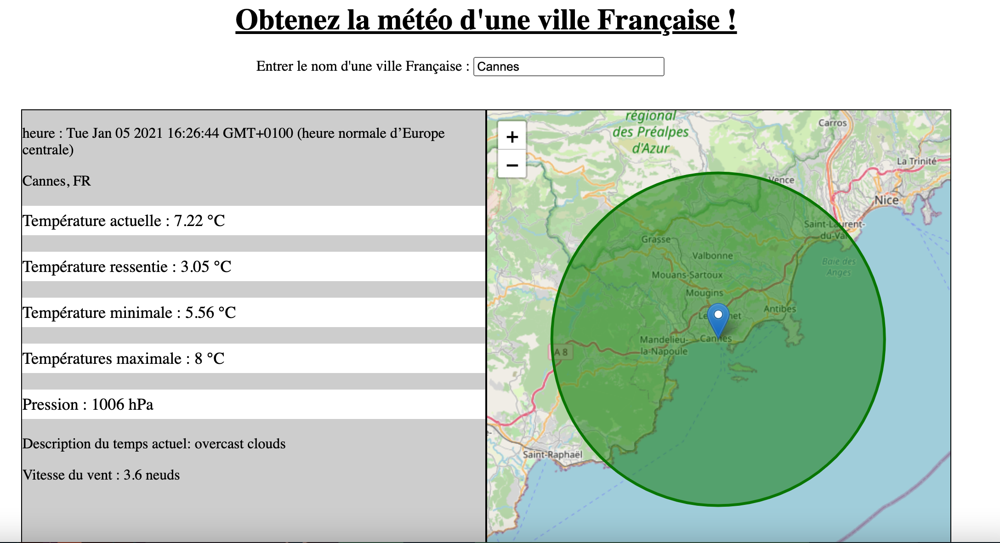

# ExoMeteo
Exo création d'une application qui donne les informations météorologiques d'une ville Française saisie

Une fonction d'auto-complétion sur le nom d'une ville Française saisie par l'utilisateur à été mis en place via une requête Ajax à chaque nouveau caractère tapé.

le nom des villes sont stocké sur une base de données.

lorsqu'une ville est sélectionnée, une requête Ajax cross domain est effectué pour récupérer la météo de la ville via l'API du site OpenWeatherMap.

On affiche ensuite les données métérologiques récupéré via l'API OpenWeatherMap, ainsi qu'une carte OpenStreetMap centré sur les coordonées gps de la ville saisie pas l'utilisateur ainsi qu'un cercle de rayon de 20km autour des coordonées gps de la ville.

**Exemple :**

